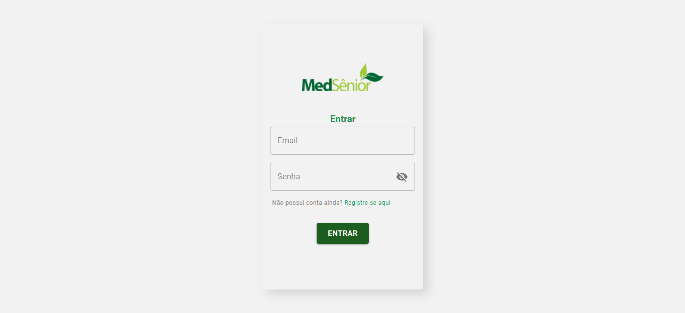

# CHALENGEMS




A frontend with small backend chalenge make to MedSênior.

## Run

Preview in [chalengems](https://chalengems.netlify.app/).

Frontend

```bash
    cd frontend
    yarn install
    yarn start
```

Backend

```bash
    cd backend
    yarn install
    yarn migrate:run
    yarn dev
```

## Technologies

- Frameworks
    - React
    - Express

- Context Tools
    - Axios
    - Context API
    - Yup

- Auth Tools
    - JWT
    - Bcrypt

- Database
    - Typeorm (ORM)
        - Postgres (Production)
        - SQLite3 (Development)

        (SQL Server, Oracle and Mysql are compatibles with typeorm)

- Hosting
    - Heroku (Backend)
    - Netlify (Frontend)

- Typescript

## LICENSE
Esse projeto está sob a licença MIT. Veja o arquivo [LICENSE](LICENSE) para mais detalhes.